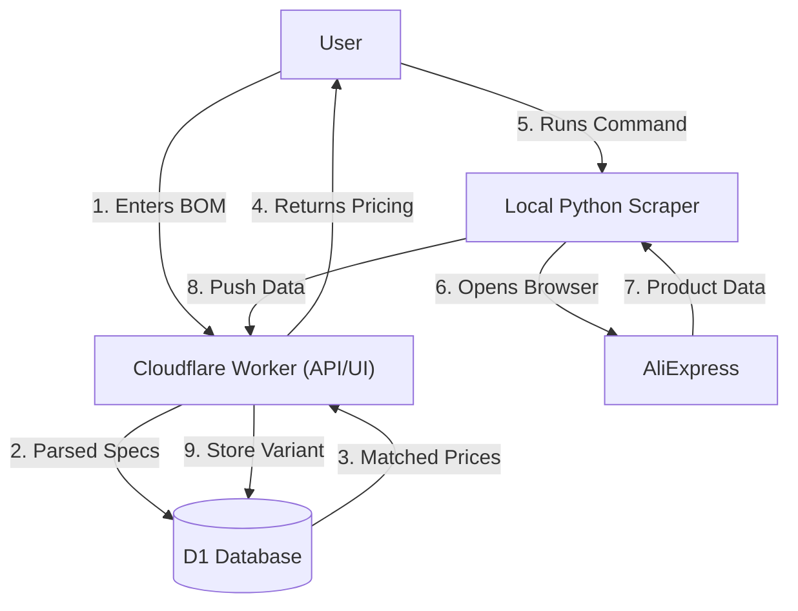

# RC BOM Builder v2.0
**Skeptical RC Buyer • Instant BOM Pricing & Sourcing**


## 🚀 Overview

**RC BOM Builder** is a specialized sourcing tool designed for drone builders and RC hobbyists. It solves the problem of "Is this just a price hallucination?" by using a **Hybrid "Nova Act" Workflow**.

Instead of relying on fragile fully-automated scrapers that get blocked, this system pairs a **Cloudflare Worker** (for BOM parsing & database) with an **Interactive Local Scraper** (where you solve the CAPTCHA, and the script does the scraping).

## ✨ Key Features

- **🛡️ Hybrid Architecture**: Cloudflare Edge backend + Human-in-the-loop local scraper.
- **🧠 Smart Spec Parsing**: Automatically detects component specs like `BATTERY:4S:1300MAH`, `ESC:30A`, or `MOTOR:2300KV`.
- **💰 Dual Currency**: Live pricing in USD and LKR (Sri Lankan Rupee).
- **🕸️ Interactive Scraper**: Uses Playwright with a visible browser. You solve the CAPTCHA; it extracts the data.
- **⚡ Cloudflare D1**: Fast, edge-based SQL database for caching product variants.

## 🛠️ System Architecture



1. **Frontend/API (Cloudflare Worker)**
   - Parses incoming BOM lines (e.g., "1300mah 4s lipo").
   - queries D1 database for matching `spec_keys`.
   - If found: Returns `MATCHED` with cached price history.
   - If missing: Returns `PENDING_CRAWL` and generates a specific scrape command.

2. **Scraper (Python + Playwright)**
   - User runs the generated command locally.
   - Opens a real Chrome browser (bypassing bot detection).
   - User handles login/CAPTCHA if needed.
   - Script extracts valid product variants matching the strict specs.
   - Pushes verified data back to the Cloudflare API.

## 📦 Installation

### Prerequisites
- Node.js & npm
- Python 3.8+
- Cloudflare Wrangler CLI

### 1. Backend Setup (Cloudflare)
```bash
# Install dependencies
npm install

# Setup Database
npx wrangler d1 create bom_pricer
npx wrangler d1 migrations execute bom_pricer --local  # For local testing
npx wrangler d1 migrations execute bom_pricer --remote # For deployment

# Deploy Worker
npx wrangler deploy
```

### 2. Scraper Setup (Local)
```bash
# Create virtual environment
python3 -m venv .venv
source .venv/bin/activate

# Install requirements
pip install playwright requests
playwright install chromium
```

## 🎯 Usage Workflow

1. **Enter BOM**: Go to the hosted URL and paste your parts list:
   ```text
   4x 2207 2400kv motor
   1x 45A 4in1 ESC
   2x 1300mah 6s lipo
   ```

2. **Check Status**: 
   - Known items show prices immediately.
   - Unknown items show a yellow `⏳ No pricing data yet` badge.

3. **Run Scraper**: 
   - Copy the command shown in the UI for missing items:
     ```bash
     cd ~/bom-pricer && source .venv/bin/activate && python scripts/scrape_interactive.py '1300MAH 6S LIPO'
     ```
   - Run it in your terminal.
   - A browser window will open. Wait for listings to load (solve CAPTCHA if prompted).
   - Press **ENTER** in the terminal to scrape and upload.

4. **See Results**: Refresh the BOM Builder page. Your items are now priced!

## 📂 Project Structure

```
bom-pricer/
├── api/
│   └── worker.js            # Main Cloudflare Worker (API + UI)
├── scripts/
│   └── scrape_interactive.py # Local Python Scraper
├── utils/
│   └── specs.js             # Shared spec parsing logic (Node/Worker)
├── schema.sql               # D1 Database Schema
└── wrangler.toml            # Cloudflare Configuration
```

## 🤝 Contributing
1. Fork the repo.
2. Create a feature branch.
3. Submit a Pull Request.

---
*Built with ❤️ for the RC Community*
